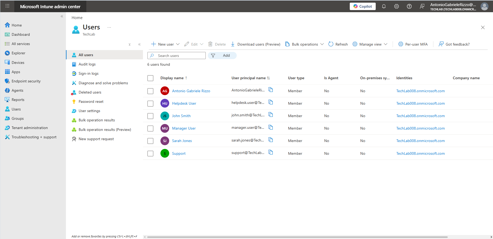

# User and Group Preparation

## Introduction

Before devices can be enrolled on Microsoft Intune, the appropriate users and groups must be prepared.

Microsoft Intune relies on Microsoft Entra ID identities to authenticate users, assign applications, deploy policies and control access to organisational resources.

Preparing users and groups correctly helps administrators simplify device management and ensures policies can be deployed efficiently to multiple users or devices.

In this chapter, an existing user account and security group created during the Microsoft Entra ID laboratory are reused to prepare the Intune environment for device enrolment.

---

# Objectives

After completing this chapter, I will be able to:

- Identify users available for Microsoft Intune.
- Verify that Microsoft Intune is correctly licensed.
- Review Security Groups.
- Verify group membership.
- Review administrative roles.
- Confirm that a user is ready for device enrolment.

---

# Prerequisites

Before starting this chapter, I had already:

- Completed Chapter 01 – Creating the Intune Lab Environment.
- Completed Chapter 02 – Intune Administration Center Overview.
- Access to the Microsoft Intune Admin Center.
- A Global Administrator account.
- The Microsoft Intune Plan 1 Trial was activated.

---

# Why Users and Groups Are Important

Microsoft Intune uses Microsoft Entra ID to identify users and devices.

Every enrolled device is associated with a user account, allowing administrators to deploy applications, compliance policies and configuration profiles based on user or group membership.

Rather than configuring each user individually, organisations typically assign policies to Security Groups. This approach simplifies administration and makes future management significantly easier.

Throughout the remainder of this repository, the existing **IT Support Team** Security Group will be reused when assigning policies and applications.

---

# Viewing Existing Users

Open the Microsoft Intune Admin Center.

Navigate to:

```text
Users
    └── All users
```

The Users page displays all identities available within the Microsoft Entra ID tenant.

From this page, administrators can:

- View user accounts.
- Reset passwords.
- Manage licences.
- Review assigned roles.
- Monitor sign-in activity.

For this laboratory, the user accounts created during the Microsoft Entra ID repository are reused.



---

# Verifying the Microsoft Intune Subscription

Before devices can be enrolled, Microsoft Intune must be available within the Microsoft 365 tenant.

Navigate to:

```text
Microsoft 365 Admin Center

Billing
    └── Your products
```

Verify that **Microsoft Intune Plan 1** is listed as an active subscription.

This confirms that the tenant is licensed for Microsoft Intune administration.


---

# Reviewing Existing Security Groups

Security Groups allow administrators to manage multiple users simultaneously.

Instead of assigning applications or policies to individual users, administrators assign them to groups.

This simplifies administration and ensures consistent configuration across the organisation.

Navigate to:

```text
Groups
    └── All groups
```

Locate the **IT Support Team** Security Group created during the Microsoft Entra ID laboratory.


---

# Reviewing the IT Support Team Security Group

Open the **IT Support Team** group.

The Overview page displays useful information including:

- Group name.
- Group type.
- Membership type.
- Creation date.
- Number of members.

Because this Security Group already exists, it can be reused throughout the remaining chapters of this repository when assigning applications, compliance policies and configuration profiles.


---

# Reviewing Group Membership

After creating or selecting a Security Group, it is good practice to verify its membership.

Navigate to:

```text
IT Support Team
    └── Members
```

The Members page displays every user currently assigned to the Security Group.

At the time of writing, the **Helpdesk User** account is a member of the **IT Support Team** Security Group.

This confirms that the group is ready to be used for future policy and application assignments.

As additional users are added to the group, they will automatically inherit any applications or policies assigned to it.


---

# Reviewing User Group Membership

Next, verify that the user belongs to the correct Security Group.

Navigate to:

```text
Users
    └── Helpdesk User
            └── Groups
```

The Groups page displays every Microsoft Entra ID group to which the selected user belongs.

Reviewing group membership is an important troubleshooting step because application deployments and compliance policies are often assigned to Security Groups rather than individual users.

The **Helpdesk User** account is correctly assigned to the **IT Support Team** Security Group.


---

# Reviewing Administrative Roles

Microsoft Intune uses Microsoft Entra ID administrative roles to control access to management features.

Navigate to:

```text
Users
    └── Antonio Gabriele Rizzo
            └── Assigned roles
```

Review the administrative role assigned to the account.

For this laboratory, the administrator account has sufficient permissions to manage Microsoft Intune.

Understanding assigned roles helps administrators verify that the correct permissions have been granted before managing devices or configuring policies.


---

# Reviewing Administrative Roles

Microsoft Entra ID uses administrative roles to control which management tasks can be performed within Microsoft Intune and other Microsoft cloud services.

Navigate to:

```text
Users
    └── Antonio Gabriele Rizzo
            └── Assigned roles
```

Review the roles assigned to the administrator account.

For this laboratory, the account has the permissions required to configure and manage the Microsoft Intune environment.

Understanding administrative roles is important because they determine which tasks an administrator is authorised to perform.


---

# Confirming the User Is Ready for Enrolment

Finally, review the administrator account.

Navigate to:

```text
Users
    └── Antonio Gabriele Rizzo
            └── Overview
```

The Overview page provides a summary of the user account, including:

- User information
- Assigned licence
- Assigned role
- Group memberships
- Account status

Verifying this information before enrolling devices helps ensure that the environment has been prepared correctly.


---

# Key Learnings

- Microsoft Intune uses Microsoft Entra ID users to identify and manage devices.
- Security Groups simplify the deployment of applications and policies.
- Verifying group membership helps ensure users receive the correct assignments.
- Administrative roles determine which management tasks an administrator can perform.
- Reviewing user information before enrolment helps prevent configuration issues.
- Preparing users and groups is an essential step before enrolling devices into Microsoft Intune.

---

# Skills Demonstrated

- Reviewing Microsoft Entra ID users.
- Verifying Microsoft Intune licensing.
- Reviewing Security Groups.
- Verifying group membership.
- Reviewing administrative roles.
- Preparing users for device enrolment.
- Technical documentation using GitHub and Markdown.

---

# Interview Tip

A Junior Microsoft Intune Administrator should understand that Microsoft Intune does not manage identities independently.

User accounts, Security Groups and administrative roles are provided by Microsoft Entra ID and are used throughout Microsoft Intune to control access, assign applications and deploy policies.

Understanding this relationship demonstrates a solid grasp of how Microsoft's cloud management services work together.

---

# Chapter Summary

In this chapter, existing users and Security Groups created during the Microsoft Entra ID laboratory were reviewed and prepared for Microsoft Intune.

The Microsoft Intune subscription was verified, Security Group membership was confirmed, administrative roles were reviewed and the administrator account was validated for future device enrolment.

The environment is now fully prepared for the next stage of the laboratory.

In the next chapter, an Android device will be enrolled into Microsoft Intune using the Company Portal application.
