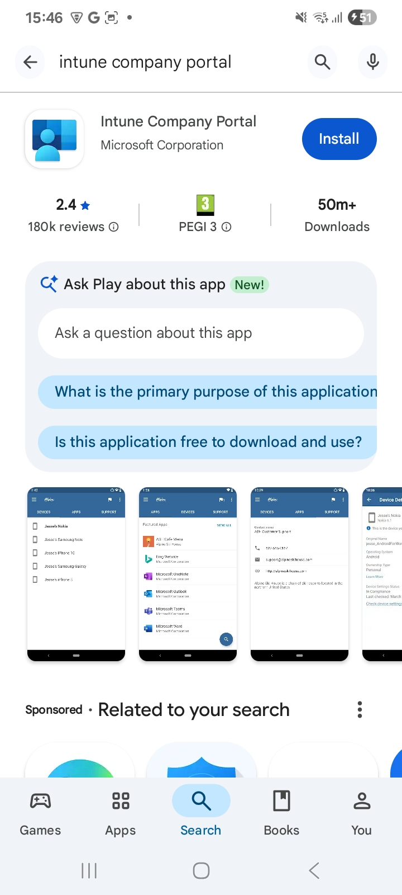
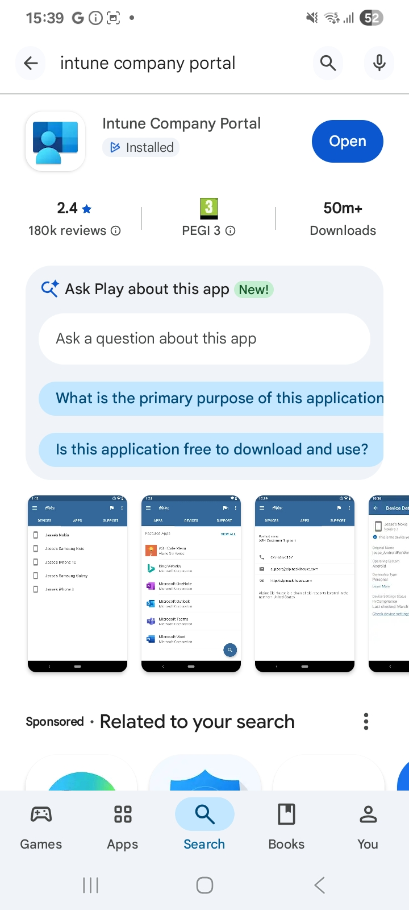
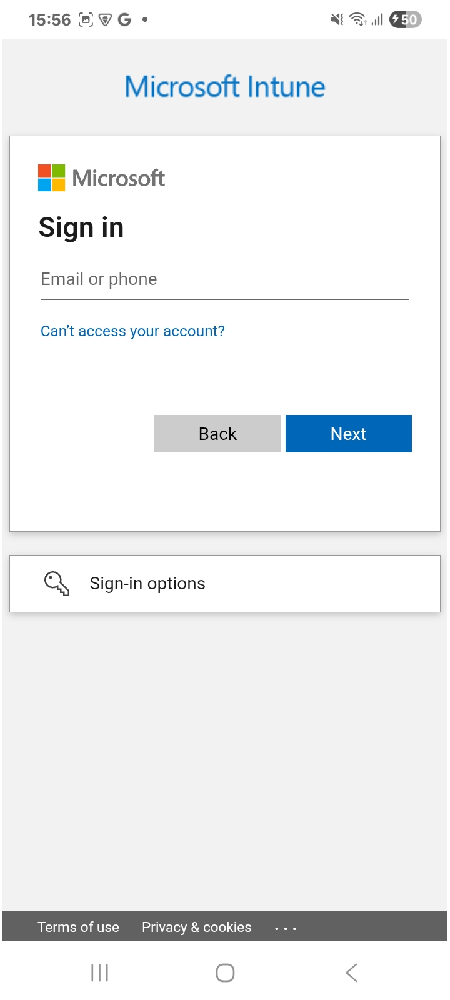
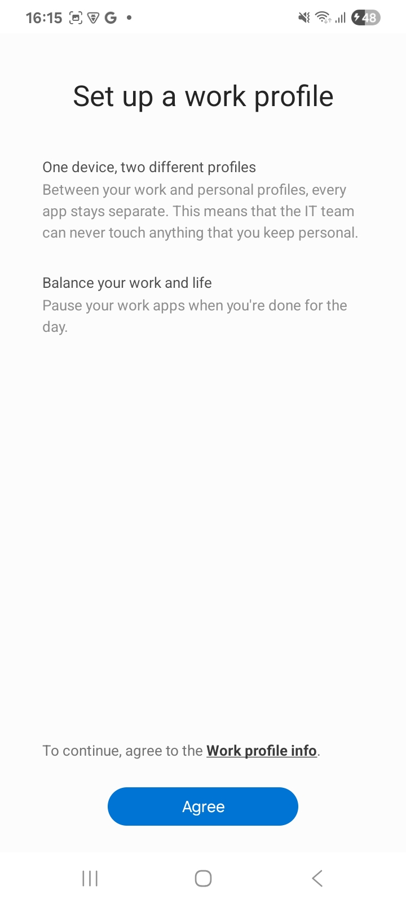
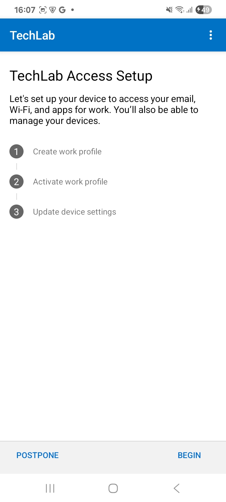
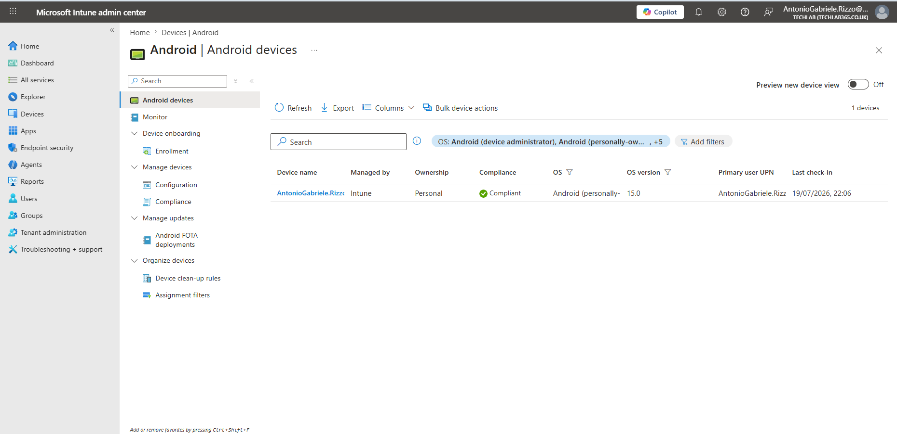

# 04 – Android Device Enrolment

## Overview

Before devices can be managed through Microsoft Intune, they must first be enrolled into the service. Device enrolment establishes a trusted relationship between the endpoint and Microsoft Intune, allowing administrators to deploy applications, configure security policies, enforce compliance requirements and perform ongoing device management.

Microsoft Intune supports several Android Enterprise enrolment scenarios designed to accommodate different ownership models and organisational requirements. Selecting the appropriate enrolment method is essential, as it determines how the device is managed, the level of control available to administrators and how corporate data is separated from personal information.

For this chapter, I enrolled my personal Android smartphone using the **Personally Owned Device with Work Profile** enrolment method. This approach creates a dedicated work profile on the device, allowing corporate applications and data to remain isolated from personal content while preserving the user's privacy.

Throughout this exercise, I used Microsoft Company Portal to register the device, create the Android Enterprise work profile and successfully enrol the device into Microsoft Intune.

---

# Android Enterprise Enrolment Methods

Microsoft Intune supports several Android Enterprise enrolment models, each designed for different organisational requirements.

| Enrolment Method | Typical Scenario |
|------------------|------------------|
| Personally Owned with Work Profile | Employees use their own Android device while organisational data remains isolated within a secure work profile. |
| Corporate-Owned Dedicated Devices | Shared devices used for a single business purpose such as kiosks or digital signage. |
| Corporate-Owned Fully Managed Devices | Organisation-owned devices managed entirely by Microsoft Intune. |
| Corporate-Owned Work Profile | Organisation-owned devices that separate business and personal data through a managed work profile. |

For this laboratory, I selected the **Personally Owned with Work Profile** deployment model because it closely reflects the Bring Your Own Device (BYOD) scenario commonly implemented within enterprise environments.

---

# Installing Microsoft Company Portal

Android Enterprise enrolment begins by installing the Microsoft Company Portal application from the Google Play Store. Company Portal provides the interface required to register the device, authenticate the user account and establish communication between the device and Microsoft Intune.

I installed Microsoft Company Portal directly from the Google Play Store on my Android device.

After the installation completed successfully, Company Portal became available on the device and was ready to begin the enrolment process.

---

# Registering the Device

After launching Company Portal, I signed in using my Microsoft Entra work account associated with my Microsoft Intune tenant.

During the sign-in process, Company Portal validated my credentials and confirmed that my account was authorised to enrol Android devices within the tenant.

Successful authentication initiated the Android Enterprise registration process and prepared the device for work profile creation.

# Creating the Android Enterprise Work Profile

Once authentication was completed, Microsoft Company Portal explained that a separate Android Enterprise work profile would be created on the device.

The work profile provides logical separation between personal and organisational data, allowing business applications, corporate accounts and managed data to remain isolated from personal applications and information. This approach enables organisations to secure corporate resources without requiring full control over the employee's personal device.

Microsoft Company Portal presented information describing the purpose of the work profile before continuing with the enrolment process.

After reviewing the information, I continued with the setup process to create the managed work profile.

Android automatically provisioned the work profile, installed the required management components and configured the device for Android Enterprise management.

The enrolment process completed successfully, resulting in a dedicated work profile being created alongside my personal profile. Corporate applications and organisational data are now contained within the managed environment while my personal applications and information remain separate.

---

# Verifying Device Enrolment

After the enrolment process completed, I verified that the device had successfully registered with Microsoft Intune by opening the Microsoft Intune Admin Center.

Navigating to **Devices > Android > Android devices** displayed the newly enrolled smartphone together with key management information, including the ownership type, management authority, compliance state, Android version, assigned user and latest check-in time.

This confirmed that the enrolment process had completed successfully and that the device was actively communicating with Microsoft Intune.

---

# Device Synchronisation

Once enrolled, Android Enterprise devices periodically synchronise with Microsoft Intune to receive configuration changes, application deployments and policy updates.

Synchronisation occurs automatically at regular intervals, although administrators and users can also manually initiate a synchronisation when immediate updates are required. This ensures that newly assigned applications, configuration profiles and compliance policies are delivered to the device without unnecessary delay.

Although I did not perform a manual synchronisation during this exercise, the successful device check-in shown within the Microsoft Intune Admin Center confirmed that communication between the enrolled device and the Intune service was functioning correctly.

---

# Device Properties and Compliance

Following enrolment, Microsoft Intune begins collecting hardware and management information from the enrolled device. Administrators can review details such as the device model, Android version, ownership type, primary user and management status directly from the Intune Admin Center.

Compliance status is also evaluated after enrolment. Initially, the device is assessed against any compliance policies assigned to the user or device. Since compliance policies are configured later in this repository, this chapter focuses on confirming that the device enrolled successfully and established communication with Microsoft Intune.

The successful check-in and compliant status displayed within the Intune Admin Center confirmed that the device was correctly enrolled and ready for further management tasks, including application deployment, compliance policies and configuration profiles covered in the following chapters.

# Summary

In this chapter, I successfully enrolled a physical Android smartphone into Microsoft Intune using the **Android Enterprise Personally Owned with Work Profile** enrolment method.

The enrolment process began by installing Microsoft Company Portal from the Google Play Store before signing in with my Microsoft Entra work account. Company Portal then guided me through creating an Android Enterprise work profile, providing a secure separation between personal and organisational data while enabling Microsoft Intune to manage corporate resources on the device.

After the enrolment completed, I verified that the device had successfully registered with Microsoft Intune by confirming that it appeared within the Microsoft Intune Admin Center with a compliant status and recent check-in information.

Completing this exercise established the foundation required for the remaining chapters in this repository. With the device successfully enrolled, it is now ready to receive managed applications, compliance policies, configuration profiles and security settings through Microsoft Intune.

---

# Key Takeaways

- Microsoft Intune supports multiple Android Enterprise enrolment methods for different organisational requirements.
- Microsoft Company Portal is used to register and enrol personally owned Android devices.
- Android Enterprise work profiles provide logical separation between personal and corporate data.
- Successfully enrolled devices appear within the Microsoft Intune Admin Center and begin communicating with the Intune service.
- Device enrolment is the first step in the endpoint lifecycle and enables further management through Microsoft Intune.

---

# Skills Demonstrated

Throughout this chapter, I developed practical experience in:

- Android Enterprise administration
- Microsoft Intune device enrolment
- Microsoft Company Portal configuration
- Mobile Device Management (MDM)
- Personally owned (BYOD) device enrolment
- Android Enterprise work profile deployment
- Endpoint lifecycle management
- Verifying successful device enrolment
- Technical documentation

---

# Next Chapter

The next chapter focuses on deploying Android Enterprise applications using **Managed Google Play**.

I will integrate Managed Google Play with Microsoft Intune, import Android applications, create deployment groups, assign applications to managed users and verify successful deployment on the enrolled Android device.

# References

The following Microsoft Learn documentation was used as a reference throughout this chapter.

- Microsoft. (2025). *Android Enterprise enrollment overview*. https://learn.microsoft.com/mem/intune/enrollment/android-enroll
- Microsoft. (2025). *Set up Android Enterprise personally owned devices with a work profile*. https://learn.microsoft.com/mem/intune/enrollment/android-work-profile-enroll
- Microsoft. (2025). *Microsoft Intune documentation*. https://learn.microsoft.com/mem/intune/

---

**Repository:** TechLab – Microsoft Intune Administration Portfolio  
**Chapter:** 04 – Android Device Enrolment  
**Platform:** Microsoft Intune • Android Enterprise • Microsoft Entra ID  
**Status:** ✅ Completed
