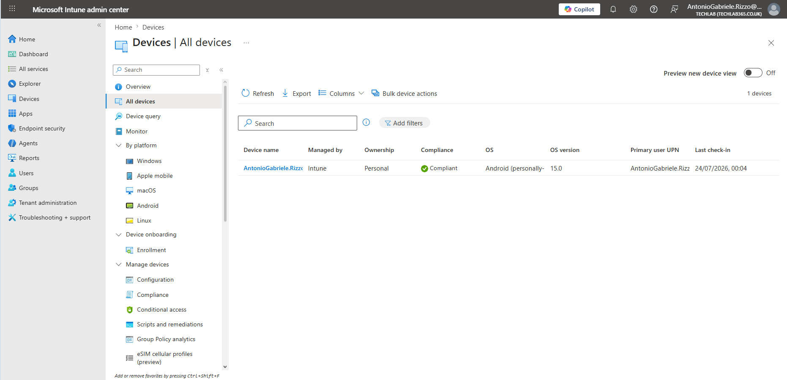
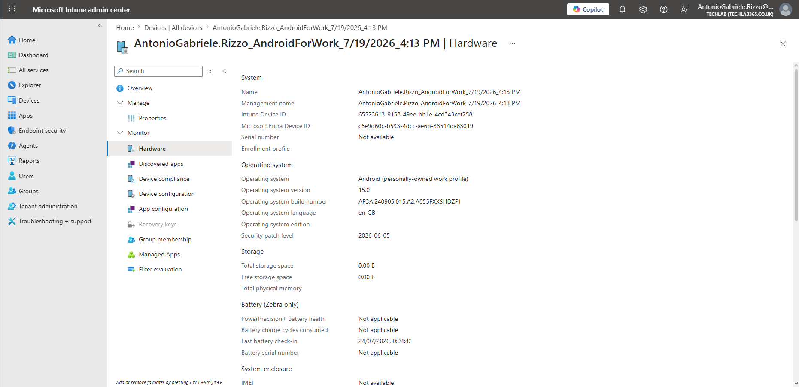
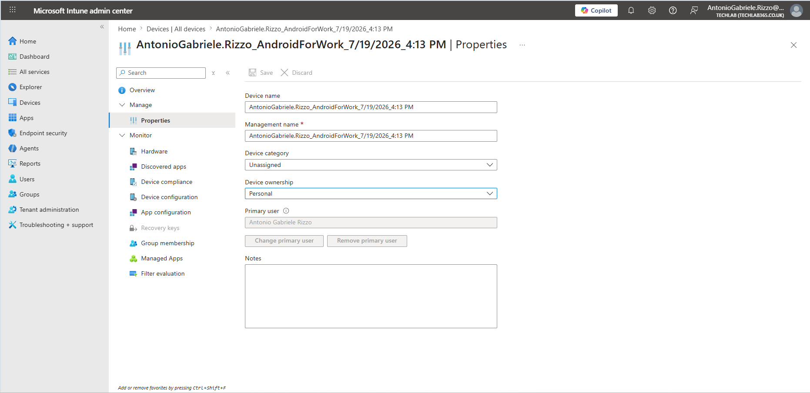
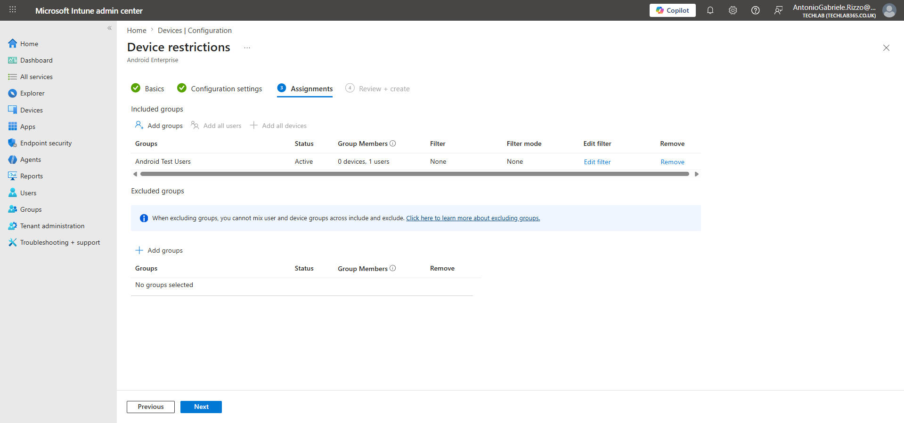

# 08 – Device Management

## Introduction

After enrolling Android Enterprise devices into Microsoft Intune and deploying applications, compliance policies and configuration profiles, administrators must continuously monitor and manage those devices throughout their lifecycle.

Microsoft Intune provides a comprehensive set of device management capabilities that allow administrators to monitor device health, review hardware information, verify policy assignments and perform remote administrative actions such as synchronisation, remote lock, passcode reset, retirement and device deletion.

Effective device management enables organisations to maintain security, troubleshoot issues remotely and ensure that managed devices continue to comply with organisational requirements without requiring physical access to the device.

In this chapter, I explored the Microsoft Intune device management interface for my enrolled Android Enterprise work profile device. I reviewed the device inventory, examined the device properties and hardware information, verified policy assignments and learned how remote management actions can be used throughout the lifecycle of a managed Android Enterprise device.

---

# Objectives

After completing this chapter, I will be able to:

- Navigate the Microsoft Intune device management interface.
- Review the inventory of enrolled Android Enterprise devices.
- Examine device properties and hardware information.
- Understand device compliance and configuration status.
- Perform remote synchronisation of managed devices.
- Understand the purpose of remote administrative actions.
- Explain the lifecycle of a managed Android Enterprise device.
- Apply Microsoft Intune device management best practices.

---

# Prerequisites

Before starting this chapter, I had already completed:

- Chapter 01 – Creating the Intune Lab Environment
- Chapter 02 – Intune Administration Center Overview
- Chapter 03 – User and Group Preparation
- Chapter 04 – Android Device Enrolment
- Chapter 05 – Deploying Android Applications with Managed Google Play
- Chapter 06 – Compliance Policies
- Chapter 07 – Configuration Profiles

In addition, the following components were already configured:

- Microsoft Intune tenant
- Android Enterprise connector
- Personally-Owned Android Enterprise work profile device
- Microsoft Company Portal
- Android Test Users Security Group
- Android Enterprise Compliance Policy
- Android Enterprise Configuration Profile

---

# Understanding Device Management

Once a device has been successfully enrolled into Microsoft Intune, administrators can monitor and manage it throughout its entire lifecycle.

Unlike Configuration Profiles and Compliance Policies, which configure or evaluate devices, the **Devices** section within Microsoft Intune provides a central location for viewing enrolled devices, monitoring their status and performing remote administrative actions.

Typical management tasks include:

- Reviewing enrolled devices
- Checking hardware information
- Verifying compliance
- Reviewing assigned configuration profiles
- Synchronising devices
- Resetting passcodes
- Remotely locking devices
- Retiring devices
- Wiping devices
- Deleting device records

These capabilities allow administrators to manage devices without requiring physical access, making Microsoft Intune an effective cloud-based endpoint management solution.

To access the device inventory, navigate to:

```text
Microsoft Intune Admin Center

Devices
    └── All devices
```

The **All devices** page displays every device currently enrolled within the Microsoft Intune tenant together with important management information such as operating system, ownership, compliance status and last check-in time.



---

# Reviewing the Device Overview

After selecting the enrolled Android Enterprise device from the **All devices** inventory, Microsoft Intune opens the **Overview** page. This page acts as the primary management dashboard for the selected endpoint and provides administrators with a consolidated view of the device's current status.

From this page, administrators can quickly determine whether the device is communicating successfully with Microsoft Intune, whether it complies with organisational policies and whether any remote management actions have recently been performed.

The Overview page displays important management information including:

- Device name
- Operating system
- Manufacturer
- Model
- Ownership
- Primary user
- Compliance status
- Management status
- Last check-in
- Enrolment information

This information provides administrators with an immediate assessment of the managed endpoint before performing more detailed investigations.

During this laboratory, my Android Enterprise device displayed a healthy management status and was communicating successfully with Microsoft Intune.


---

# Understanding Device Status

Several of the values displayed on the Overview page are particularly important during day-to-day administration.

### Compliance

The **Compliance** field indicates whether the device satisfies every assigned Compliance Policy.

Because the Android Enterprise Compliance Policy created in Chapter 06 had already been evaluated successfully, the device reported a status of **Compliant**.

This status becomes particularly important when Microsoft Entra Conditional Access is configured, as organisations frequently allow access to Microsoft 365 services only from compliant devices.

### Last Check-in

The **Last check-in** field records the most recent successful communication between the device and Microsoft Intune.

Every enrolled device periodically synchronises with the Intune service to:

- Receive newly assigned applications.
- Download Configuration Profiles.
- Evaluate Compliance Policies.
- Upload inventory information.
- Report management status.

When troubleshooting deployment issues, experienced Intune administrators often begin by checking the **Last check-in** value. If the device has not communicated recently, newly deployed policies or applications may not yet have reached the endpoint.

### Ownership

The **Ownership** field identifies whether the device is managed as:

- Personal
- Corporate

Since this laboratory uses the **Android Enterprise Personally-Owned Work Profile** enrolment method, Microsoft Intune correctly identifies the device as **Personal**.

This distinction is important because the available management capabilities differ depending on the enrolment model. Personally-Owned Work Profile devices intentionally expose fewer administrative controls than Fully Managed or Corporate-Owned Android Enterprise devices in order to preserve user privacy.

---

# Understanding Remote Device Actions

The Device Overview page also provides administrators with several remote management actions.

Although not every action is available for every Android Enterprise enrolment method, the available options demonstrate how Microsoft Intune can administer devices remotely without requiring physical access.

Typical remote actions include:

| Action | Purpose |
|---------|---------|
| **Sync** | Forces the device to immediately communicate with Microsoft Intune and retrieve pending policies or applications. |
| **Remote lock** | Locks the managed device remotely when supported by the enrolment method. |
| **Reset passcode** | Resets the work profile passcode where supported. |
| **Retire** | Removes organisational data whilst preserving the user's personal information. |
| **Wipe** | Restores the device to factory settings. Typically used for lost or stolen corporate devices. |
| **Delete** | Removes the device record from Microsoft Intune without affecting the physical device. |

Understanding the purpose of each action is an important part of endpoint administration because different scenarios require different responses.

For example:

- A user leaving the organisation may require the device to be **Retired**.
- A lost corporate device may need to be **Wiped**.
- A device that has been decommissioned may simply be **Deleted** from Microsoft Intune after retirement.

Selecting the appropriate action helps protect organisational data whilst minimising disruption to end users.

---

# Reviewing Hardware Information

In addition to monitoring device status, Microsoft Intune automatically collects detailed hardware information from enrolled devices. This inventory enables administrators to identify managed endpoints, verify hardware specifications and troubleshoot compatibility issues without requiring physical access to the device.

To review the hardware inventory, navigate to:

```text
Devices
    └── All devices
            └── <Android Device>
                    └── Hardware
```

The **Hardware** page displayed detailed information about my enrolled Android Enterprise device, including:

- Manufacturer
- Model
- Android version
- Operating system build
- Serial number
- Storage capacity
- Available storage
- Physical memory
- IMEI (where supported)
- Wi-Fi MAC address

Maintaining an accurate hardware inventory is particularly valuable in enterprise environments because administrators frequently need to verify device specifications before deploying applications, troubleshooting operating system issues or planning hardware replacement programmes.

Unlike traditional on-premises device management, Microsoft Intune retrieves this information automatically during device synchronisation, ensuring that administrators always have access to up-to-date inventory information.



---

# Reviewing Device Properties

Whereas the **Hardware** page focuses on the physical characteristics of the endpoint, the **Properties** page contains administrative information describing how the device is managed within Microsoft Intune.

To review the device properties, navigate to:

```text
Devices
    └── All devices
            └── <Android Device>
                    └── Properties
```

The Properties page provides information including:

- Device name
- Management name
- Ownership
- Primary user
- Device category
- Enrolment type
- Management state
- Microsoft Entra device information

Reviewing these properties enables administrators to verify that the device has been enrolled correctly and that it is associated with the expected user account.

During this laboratory, I confirmed that:

- the device was enrolled as an **Android Enterprise Personally-Owned Work Profile** device;
- Microsoft Intune correctly identified the ownership as **Personal**;
- the correct Microsoft Entra user was associated with the device; and
- the device remained actively managed by Microsoft Intune.

Verifying this information forms an important part of troubleshooting because many policy assignments and management capabilities depend upon the enrolment method and ownership type.



---

# Verifying Assigned Configuration Profiles

One of the final management tasks performed during this laboratory was verifying that the Configuration Profile created in the previous chapter had been successfully assigned to the enrolled device.

Rather than assuming that a policy has been deployed successfully, Microsoft Intune allows administrators to review every Configuration Profile associated with a managed endpoint.

To review the assigned profiles, navigate to:

```text
Devices
    └── All devices
            └── <Android Device>
                    └── Configuration profiles
```

The **Configuration profiles** page confirmed that the **Android Work Profile Device Restrictions** profile created in Chapter 07 had been assigned successfully.

Reviewing assigned profiles provides an additional verification step before troubleshooting deployment issues. If a required Configuration Profile does not appear in this list, administrators should first verify the assignment target rather than investigating the device itself.

In enterprise environments, devices often receive multiple Configuration Profiles from different Security Groups. Reviewing the assigned profiles allows administrators to identify missing assignments, duplicate policies or conflicting configurations more efficiently.



---

# Device Management Best Practices

Managing enrolled devices extends beyond deploying policies and applications. Effective endpoint administration requires regular monitoring, proactive maintenance and a structured approach to troubleshooting.

During this laboratory, I identified several best practices that help administrators manage Android Enterprise devices efficiently within Microsoft Intune.

### Regularly Monitor Device Check-in

One of the first values administrators should verify is the **Last check-in** time.

If a device has not communicated with Microsoft Intune recently, newly assigned applications, Configuration Profiles and Compliance Policies may not yet have been delivered.

A recent check-in confirms that the device is actively communicating with the Intune service.

### Verify Compliance Before Troubleshooting

Before investigating deployment issues, administrators should confirm that the device remains **Compliant**.

Compliance failures may prevent access to corporate resources, particularly when Microsoft Entra Conditional Access policies are in use.

Understanding the compliance state often reduces unnecessary troubleshooting because the root cause may be a failed Compliance Policy rather than an application or configuration issue.

### Use Security Groups for Policy Assignments

Throughout this repository, applications, Compliance Policies and Configuration Profiles were assigned using Microsoft Entra Security Groups.

This approach provides a scalable administration model because future users automatically inherit the required assignments when added to the appropriate group.

Managing group membership is significantly more efficient than assigning resources individually.

### Understand the Device Ownership Model

Android Enterprise supports several ownership models, each providing different management capabilities.

Personally-Owned Work Profile devices intentionally provide fewer remote management actions than Corporate-Owned or Fully Managed devices.

Understanding these differences helps administrators select the appropriate enrolment model based on organisational requirements and user privacy expectations.

---

# Key Learnings

During this chapter, I learned that:

- Microsoft Intune provides a centralised interface for managing enrolled Android Enterprise devices.
- The **All devices** page serves as the primary inventory for managed endpoints.
- The Device Overview page provides immediate visibility into the health and management status of enrolled devices.
- Hardware information is collected automatically and assists with inventory management and troubleshooting.
- Device Properties provide important administrative information about enrolment, ownership and management.
- Configuration Profile assignments can be verified directly from the managed device.
- Remote management actions allow administrators to manage devices without requiring physical access.
- Device synchronisation enables managed devices to retrieve newly assigned policies and applications.

---

# Skills Demonstrated

Throughout this chapter, I demonstrated the following Microsoft Intune administration skills:

- Android Enterprise device management.
- Device inventory management.
- Hardware inventory analysis.
- Device property verification.
- Configuration Profile verification.
- Device lifecycle administration.
- Remote device management.
- Endpoint troubleshooting.
- Microsoft Intune administration.
- Technical documentation using GitHub and Markdown.

---

# Interview Tip

A common interview question for Microsoft Intune Administrator and IT Support Engineer roles is:

> **"What information would you review first when troubleshooting a managed device that is not receiving policies?"**

A structured answer could include the following steps:

1. Verify the device has checked in recently.
2. Confirm the device is compliant.
3. Review the enrolment method and ownership type.
4. Verify that the required Security Groups have been assigned.
5. Confirm that the appropriate Configuration Profiles and Compliance Policies have been deployed.
6. Review the hardware and device properties for any inconsistencies.
7. Perform a manual synchronisation if necessary.

Demonstrating a logical troubleshooting methodology is often more valuable during an interview than simply listing Microsoft Intune features.

---

# Chapter Summary

In this chapter, I explored the device management capabilities available within Microsoft Intune for an Android Enterprise Personally-Owned Work Profile device.

After reviewing the enrolled device inventory, I examined the Device Overview page, analysed the hardware inventory collected by Microsoft Intune and verified the administrative properties associated with the managed endpoint.

I also confirmed that the Configuration Profile created in the previous chapter had been successfully assigned and explored the remote management actions available to administrators throughout the lifecycle of an enrolled device.

Understanding these management capabilities is essential for maintaining healthy, compliant and secure endpoints within Microsoft Intune. Together with Compliance Policies and Configuration Profiles, Device Management forms one of the core components of modern cloud-based endpoint administration.

The next chapter explores **Endpoint Security**, where Microsoft Intune provides additional security capabilities to help organisations protect managed endpoints against modern security threats.
