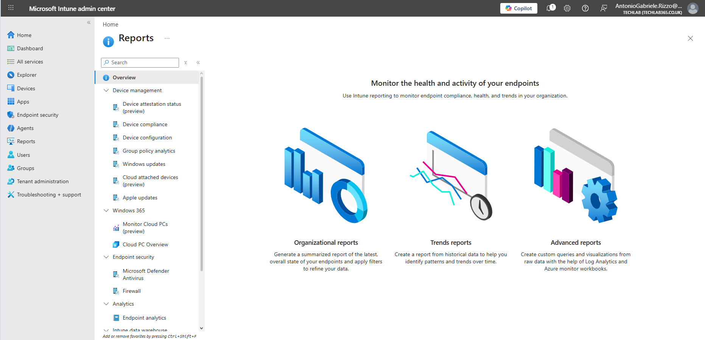
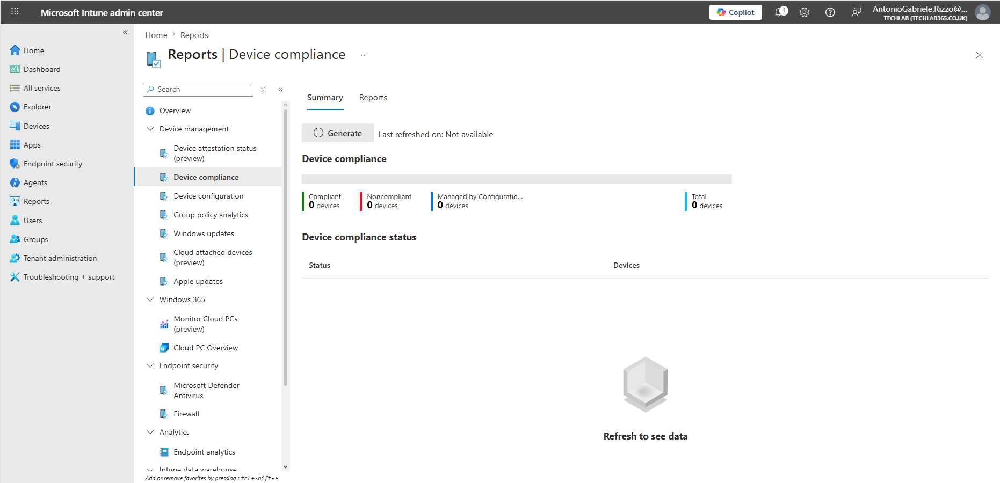
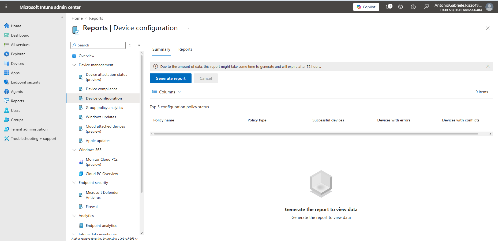
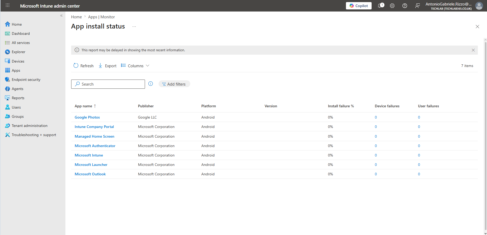
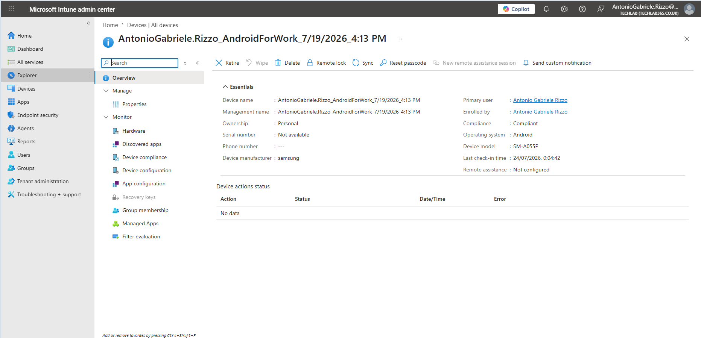
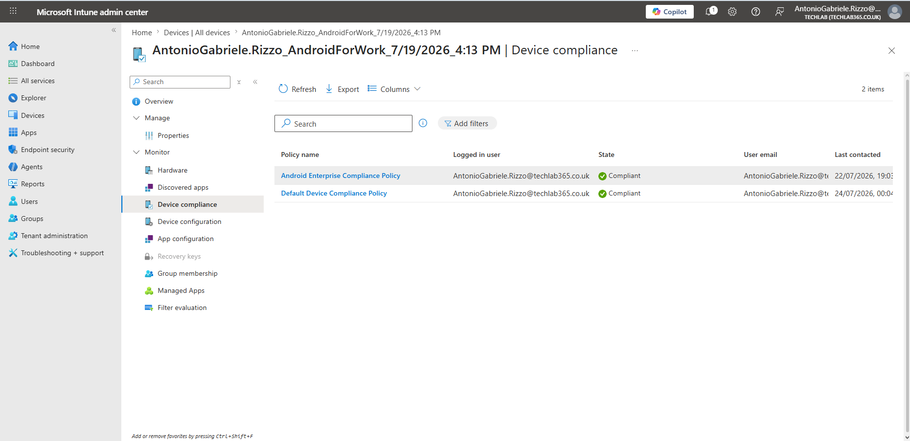

# 09 – Monitoring and Reports

## Introduction

Deploying applications, Compliance Policies and Configuration Profiles is only part of a Microsoft Intune administrator's responsibilities. Equally important is the ability to monitor managed devices, verify successful policy deployment and identify issues before they impact end users.

Microsoft Intune provides a comprehensive reporting framework that enables administrators to monitor the health, compliance and configuration of managed endpoints from a centralised interface. These reporting capabilities support proactive administration by presenting real-time information about device status, application deployments and policy evaluations.

In this chapter, I explore the reporting and monitoring features available within the Microsoft Intune Admin Center. Using the Android Enterprise device enrolled earlier in this project, I demonstrate how administrators can review compliance status, monitor configuration profile deployment, verify application installation and inspect individual device reports.

Understanding these monitoring capabilities is essential for day-to-day endpoint administration because they provide the information required to validate deployments, investigate issues and ensure devices remain compliant with organisational policies.

---

## Objectives

By the end of this chapter I will be able to:

- Understand the monitoring capabilities provided by Microsoft Intune.
- Review device compliance reports.
- Monitor Configuration Profile deployment.
- Verify Managed Google Play application installation status.
- Examine monitoring information for individual managed devices.
- Use reports to validate policy deployment and device health.

---

## Prerequisites

Before completing this chapter, the following tasks should already have been performed:

- Microsoft Intune tenant configured.
- Android Enterprise connected to Managed Google Play.
- Android device successfully enrolled.
- Managed Google Play applications deployed.
- Compliance Policies created and assigned.
- Configuration Profiles deployed.
- Device management tasks completed.

The screenshots shown throughout this chapter use the same Android Enterprise device configured during the previous chapters of this repository.

---

# Understanding Monitoring in Microsoft Intune

Microsoft Intune includes a wide range of monitoring and reporting capabilities that enable administrators to track the state of managed endpoints throughout their lifecycle. Rather than relying solely on user feedback, administrators can verify the outcome of management operations directly from the Microsoft Intune Admin Center.

Monitoring data is collected whenever managed devices communicate with the Intune service. During these check-ins, devices report information such as:

- Compliance state.
- Configuration Profile deployment status.
- Application installation results.
- Hardware inventory.
- Operating system information.
- Device ownership.
- Synchronisation activity.

This information allows administrators to determine whether deployments have completed successfully and to quickly identify devices that require further investigation.

The reporting features demonstrated throughout this chapter build upon the configuration work completed in previous chapters, allowing the results of application deployment, compliance evaluation and configuration profile assignment to be verified from a single administrative interface.

---

## Reports Overview

The Microsoft Intune **Reports** workspace provides administrators with a central location for reviewing operational information across all managed devices. Reports are organised into categories covering device management, compliance, configuration and endpoint health.

From this area administrators can:

- Review organisation-wide device compliance.
- Generate Configuration Profile reports.
- Analyse deployment success rates.
- Monitor policy assignment.
- Export report data for further analysis.

As Microsoft Intune environments grow, these reports become increasingly important because they provide visibility across hundreds or thousands of managed endpoints from a single dashboard.

*Figure 9.1 – Microsoft Intune Reports workspace providing access to monitoring and reporting features.*

# Monitoring Device Compliance

Compliance reporting enables administrators to verify whether managed devices satisfy the security requirements defined by organisational Compliance Policies. Rather than manually inspecting each device, Microsoft Intune continuously evaluates compliance during device check-ins and records the results within the reporting interface.

The **Device Compliance** report provides an organisation-wide summary of compliance status, allowing administrators to quickly identify devices that are:

- Compliant.
- Non-compliant.
- Managed through Configuration Manager.
- Awaiting evaluation.

This centralised view is particularly valuable in enterprise environments where hundreds or thousands of devices may be managed simultaneously. Administrators can use these reports to prioritise remediation activities and ensure organisational security standards are consistently enforced.

In my lab environment, the Device Compliance report provides an overview of the current compliance state of managed Android Enterprise devices. Since only a single Android device is enrolled, the report reflects the status of this test environment while demonstrating the same reporting capabilities used in production deployments.

*Figure 9.2 – Microsoft Intune Device Compliance report displaying organisation-wide compliance information.*

---

# Monitoring Configuration Profiles

Configuration Profiles are used to deploy standardised settings across managed devices. After assigning a profile, administrators must verify that the configuration has been successfully delivered and applied.

Microsoft Intune provides dedicated reporting for Configuration Profiles, enabling administrators to review deployment progress and identify any devices experiencing errors or conflicts.

The **Device Configuration** report supports the monitoring of:

- Successful profile deployments.
- Deployment errors.
- Configuration conflicts.
- Policy assignment status.
- Overall deployment progress.

In larger environments, these reports help administrators identify devices that have failed to receive configuration settings, allowing corrective action to be taken before users are affected.

Because this laboratory contains a limited number of managed devices, the report does not contain extensive deployment data. Nevertheless, it demonstrates the reporting interface that administrators use to monitor Configuration Profile deployment across enterprise environments.

*Figure 9.3 – Monitoring Configuration Profile deployment through Microsoft Intune reporting.*

---

# Monitoring Managed Applications

Application deployment does not end once an app has been assigned to a device or user. Administrators must also confirm that applications have been successfully installed and identify any deployment failures.

The **App Install Status** report provides detailed information about Managed Google Play applications deployed through Microsoft Intune. For each application, administrators can review:

- Application name.
- Publisher.
- Target platform.
- Installed version.
- Installation failure percentage.
- Device failures.
- User failures.

This information enables administrators to quickly determine whether application deployments have completed successfully or whether further investigation is required.

In this project, several Managed Google Play applications—including Google Photos, Microsoft Intune, Microsoft Authenticator and Microsoft Outlook—were deployed during Chapter 5. The monitoring report confirms that these applications were processed successfully without installation failures, demonstrating a successful application deployment workflow.

*Figure 9.4 – Managed application deployment status monitored through Microsoft Intune.*

---

## Interview Tip

During technical interviews, you may be asked how you verify that a policy or application has been successfully deployed.

Rather than simply stating that "the device received the policy," explain the monitoring process:

- Review the deployment report.
- Verify the device check-in time.
- Confirm the compliance state.
- Check Configuration Profile deployment status.
- Review application installation results.
- Investigate any reported errors or conflicts.

This demonstrates that you understand the complete administrative lifecycle, including deployment validation and ongoing monitoring, rather than focusing solely on policy creation.

# Reviewing Individual Device Reports

While organisation-wide reports provide a high-level overview of the environment, administrators frequently need to investigate the status of individual devices. Microsoft Intune allows each managed endpoint to be examined independently, providing detailed information about its configuration, compliance and management state.

Selecting a managed device from the **Devices** workspace opens a comprehensive overview page containing information such as:

- Device ownership.
- Compliance status.
- Operating system.
- Device model.
- Manufacturer.
- Primary user.
- Enrolment information.
- Last check-in time.
- Available remote management actions.

This information enables administrators to quickly verify that a device has been enrolled correctly and is actively communicating with Microsoft Intune.

Throughout this project, the Android Enterprise device enrolled in Chapter 4 has been used to validate application deployment, Compliance Policies and Configuration Profiles. Reviewing the device overview confirms that the device remains compliant and continues reporting successfully to Microsoft Intune.

*Figure 9.5 – Individual Android Enterprise device overview displaying key management and monitoring information.*

---

# Monitoring Compliance at Device Level

In addition to organisation-wide compliance reports, Microsoft Intune allows administrators to review the compliance evaluation of individual devices. This provides detailed visibility into the policies that have been assigned and whether each policy has been successfully evaluated.

The **Device Compliance** page displays:

- Assigned Compliance Policies.
- Compliance state.
- Logged-in user.
- Last contact time.
- Policy evaluation results.

This level of reporting is particularly useful when investigating devices that appear as non-compliant within the organisation-wide dashboard. Rather than reviewing every policy manually, administrators can immediately identify which compliance policies have been evaluated and determine whether additional troubleshooting is required.

Within my laboratory environment, the enrolled Android Enterprise device successfully satisfies both the custom Android Enterprise Compliance Policy created in Chapter 6 and the default device compliance policy automatically applied by Microsoft Intune. This confirms that the device continues to meet the security requirements configured earlier in the project.

*Figure 9.6 – Compliance policy evaluation for an individual managed Android Enterprise device.*

---

# Monitoring Best Practices

Monitoring should become part of an administrator's daily operational routine rather than being performed only after creating new policies. Regularly reviewing reports allows administrators to identify potential issues before they affect end users and helps maintain a healthy management environment.

Some recommended monitoring practices include:

- Reviewing device compliance on a regular basis.
- Verifying Configuration Profile deployment after creating new policies.
- Monitoring Managed Google Play application installations.
- Checking the last device synchronisation time when investigating issues.
- Investigating deployment failures before users report problems.
- Exporting reports when long-term analysis or auditing is required.

Following these practices helps ensure that managed devices remain compliant, secure and correctly configured throughout their lifecycle.

---

# Key Learnings

Throughout this chapter I learned how Microsoft Intune provides powerful reporting and monitoring capabilities that allow administrators to validate every stage of the device management lifecycle.

More specifically, I learned how to:

- Access the Microsoft Intune reporting workspace.
- Monitor organisation-wide device compliance.
- Review Configuration Profile deployment status.
- Monitor Managed Google Play application installations.
- Examine individual managed device information.
- Verify Compliance Policy evaluation for specific devices.
- Use monitoring data to support troubleshooting activities.

---

# Skills Demonstrated

This chapter demonstrates practical experience with:

- Microsoft Intune Monitoring
- Microsoft Intune Reporting
- Device Compliance Reporting
- Configuration Profile Monitoring
- Application Deployment Monitoring
- Endpoint Administration
- Android Enterprise Administration
- Mobile Device Management (MDM)
- Technical Documentation

---

## Interview Tip

A common interview question is:

> **"How do you verify that a managed Android device is healthy after deployment?"**

A strong answer should describe a structured validation process rather than focusing on a single report. For example:

- Confirm the device is checking in successfully.
- Verify that the device is compliant.
- Review Configuration Profile deployment.
- Confirm required applications have installed successfully.
- Inspect any reported deployment errors or conflicts.

This demonstrates an understanding of how Microsoft Intune monitoring supports proactive endpoint management and day-to-day operational support.

---

# Chapter Summary

In this chapter, I explored the monitoring and reporting capabilities available within Microsoft Intune for Android Enterprise devices. I learned how administrators can review organisation-wide compliance reports, monitor Configuration Profile deployment, verify Managed Google Play application installations and investigate individual managed devices.

These monitoring capabilities provide the visibility required to validate deployments, maintain device health and support troubleshooting activities. Together with the previous chapters, they complete the operational workflow of enrolling, configuring, managing and monitoring Android Enterprise devices using Microsoft Intune.

The final chapter of this repository will focus on common troubleshooting scenarios encountered during Microsoft Intune administration and the techniques used to diagnose and resolve them.
