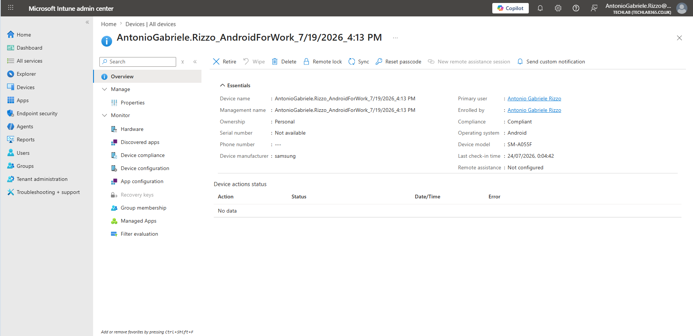
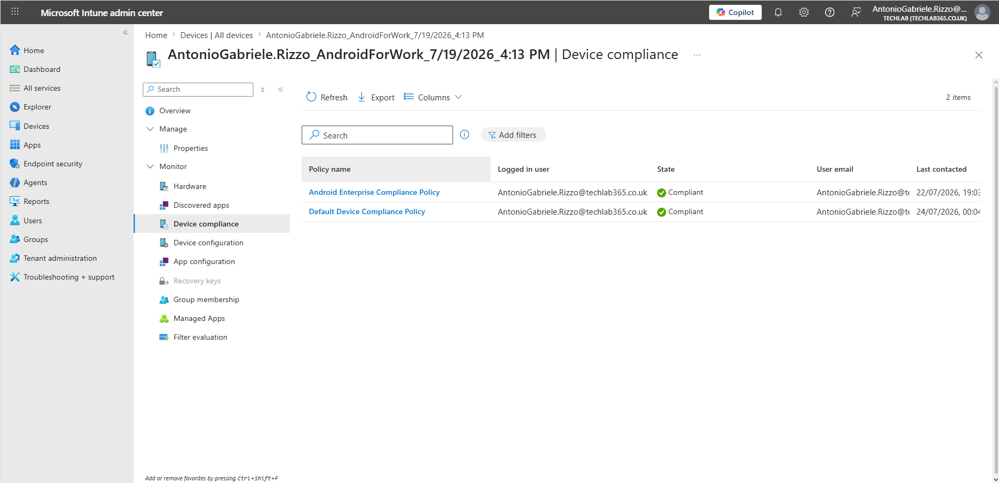
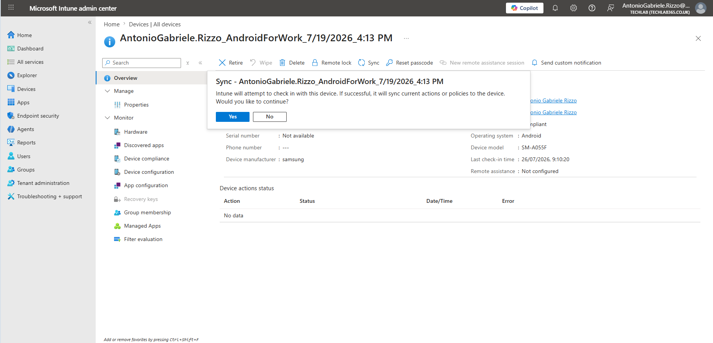
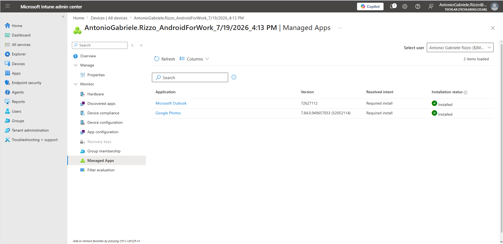
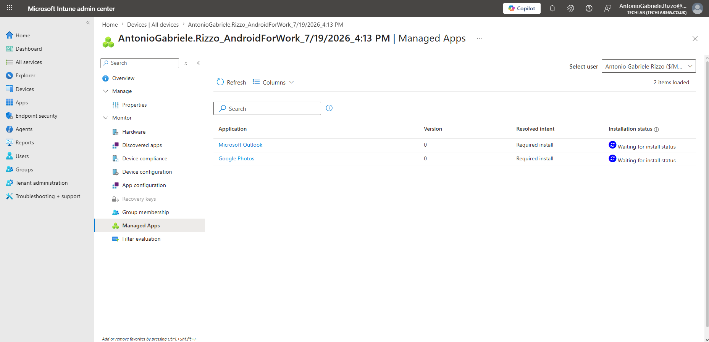

# Chapter 10 – Troubleshooting Scenarios

## Introduction

Deploying Android Enterprise devices with Microsoft Intune is only part of an administrator's responsibility. Equally important is the ability to investigate and resolve issues when devices do not behave as expected. Throughout the lifecycle of a managed device, administrators may encounter problems such as delayed policy deployment, application installation failures, devices reporting as non-compliant or inconsistent reporting between the device and the Intune service.

Microsoft Intune provides several monitoring and diagnostic tools that enable administrators to quickly identify the source of a problem and verify that corrective actions have been successful. By following a structured troubleshooting methodology, administrators can minimise downtime, maintain device compliance and ensure that managed devices continue to receive policies and applications correctly.

This chapter demonstrates a practical troubleshooting workflow using the Android Enterprise device configured throughout this repository. Rather than presenting simulated scenarios, the examples are based on real issues encountered during the implementation of the laboratory environment, illustrating how Microsoft Intune can be used to diagnose and resolve common management problems.

---

## Learning Objectives

By completing this chapter, I learned how to:

- Investigate the health of an individual managed Android Enterprise device.
- Verify Compliance Policy evaluation for a managed device.
- Diagnose application deployment issues using Microsoft Intune.
- Perform manual device synchronisation to trigger policy and application updates.
- Confirm that troubleshooting actions have successfully resolved reported issues.
- Apply a structured methodology when investigating Microsoft Intune management problems.

---

# A Structured Troubleshooting Methodology

Effective troubleshooting begins with a systematic approach rather than immediately changing policies or redeploying applications. Microsoft recommends validating the device state, reviewing assigned policies and confirming communication between the device and the Intune service before making configuration changes.

A typical troubleshooting workflow consists of the following stages:

1. Verify that the device is enrolled and actively checking in.
2. Confirm the device compliance status.
3. Review assigned Compliance Policies and Configuration Profiles.
4. Validate application deployment status.
5. Perform a manual synchronisation if the device has not recently reported to Intune.
6. Recheck the deployment status to confirm that the issue has been resolved.

Following these steps helps administrators distinguish between genuine deployment failures and temporary reporting delays, reducing unnecessary troubleshooting effort.

---

# Investigating the Managed Device

The first step when troubleshooting any managed endpoint is to review the device overview page. This page provides a consolidated view of the device's management state and immediately highlights important information required during an investigation.

From the device overview, administrators can verify:

- Device ownership.
- Primary user.
- Operating system and version.
- Compliance status.
- Last check-in time.
- Available remote management actions.
- Device manufacturer and model.

Reviewing this information allows administrators to confirm that the device is communicating correctly with Microsoft Intune before investigating more specific issues.

During this project, the Android Enterprise device remained compliant and successfully connected to Microsoft Intune, providing a solid starting point for investigating subsequent application reporting behaviour.

*Figure 10.1 – Reviewing the managed Android Enterprise device before beginning the troubleshooting process.*

---

# Verifying Device Compliance

After confirming that the device is communicating with Microsoft Intune, the next step is to verify its compliance status. Compliance Policies determine whether a managed device satisfies the security requirements configured by the organisation and are frequently one of the first areas investigated when users report access issues.

The **Device compliance** page displays all Compliance Policies assigned to the selected device together with their evaluation results. Administrators can quickly determine whether the device satisfies the required security settings or whether additional investigation is required.

Information available on this page includes:

- Assigned Compliance Policies.
- Current compliance state.
- Logged-in user.
- User email address.
- Last contact time.

In this laboratory environment, both the custom Android Enterprise Compliance Policy created in Chapter 6 and the default Microsoft Intune Compliance Policy reported a **Compliant** state. This confirmed that the troubleshooting scenario investigated later in this chapter was unrelated to device compliance and instead focused on application reporting.

*Figure 10.2 – Reviewing Compliance Policy evaluation for the managed Android Enterprise device.*

# Investigating Application Deployment Issues

Application deployment problems are among the most common issues encountered by Microsoft Intune administrators. Users may report that a required application has not appeared on their device, or administrators may observe that an application has been assigned but no installation status has been reported.

Rather than immediately redeploying the application, administrators should first determine whether the issue is related to the deployment itself or simply to a delay in device reporting. Microsoft Intune provides the **Managed Apps** page for each enrolled device, allowing administrators to review the installation status of applications targeted to that specific endpoint.

When reviewing Managed Apps, administrators can verify:

- Which applications have been assigned to the device.
- The deployment intent (Required, Available or Uninstall).
- The installed application version.
- The current installation status reported by the device.

During testing in my laboratory environment, Microsoft Intune initially reported that the required applications had not yet returned their installation status, even though the deployment had already been completed. This illustrates a common situation where the device has not yet synchronised its latest application inventory with the Intune service.

The screenshot below captures the initial state before any troubleshooting actions were performed.

*Figure 10.3 – Required applications assigned to the device while Microsoft Intune is still waiting for the installation status.*

---

## Understanding "Waiting for installation status"

At first glance, an administrator might assume that the applications have failed to install. However, this status does **not** necessarily indicate a deployment failure.

Typical causes include:

- The device has not completed a recent synchronisation with Microsoft Intune.
- The Company Portal has not yet reported the application inventory.
- Managed Google Play is still processing the installation.
- Microsoft Intune reporting has not yet refreshed.

Before making any configuration changes, administrators should always verify that the device is communicating correctly with the Intune service. Performing unnecessary redeployments or modifying application assignments can introduce additional variables that complicate the troubleshooting process.

---

# Performing a Manual Device Synchronisation

After verifying that the device was compliant and that the applications had been assigned correctly, the next logical troubleshooting step was to initiate a manual synchronisation.

A manual synchronisation forces the managed device to immediately contact Microsoft Intune and upload its latest management information, including policy evaluations, application inventory and deployment status. This is one of the most effective first-line troubleshooting actions because it avoids waiting for the next scheduled device check-in.

From the device overview page, Microsoft Intune provides a **Sync** action that administrators can use whenever they need the device to report back immediately.

In this project, I initiated a manual synchronisation from the Microsoft Intune Admin Center and also performed a synchronisation from the Company Portal application on the Android device. This ensured that both the management service and the managed device exchanged the latest configuration and application status information.

*Figure 10.4 – Initiating a manual synchronisation to refresh device information and application reporting.*

---

# Confirming the Resolution

Following the manual synchronisation, Microsoft Intune successfully refreshed the application inventory reported by the Android Enterprise device. The applications that had previously displayed a status of **Waiting for installation status** were now reported as **Installed**.

This confirmed that the issue was not caused by an application deployment failure. Instead, the delay resulted from the time required for the managed device to communicate its application inventory back to the Microsoft Intune service.

This scenario highlights an important lesson for administrators: not every warning or pending status indicates a configuration problem. Many apparent issues are simply the result of reporting latency between the managed device and the Intune cloud service.

Before modifying assignments or recreating applications, administrators should always allow sufficient time for synchronisation and, where appropriate, perform a manual device sync.

The screenshot below shows the successful result after completing the synchronisation process.

*Figure 10.5 – Application installation status successfully updated after the managed device synchronised with Microsoft Intune.*

---

# Verifying the Final Application Status

Once the synchronisation had completed successfully, I performed one final verification using the **Managed Apps** page for the enrolled Android Enterprise device.

This page provides administrators with a consolidated view of all managed applications currently associated with the selected endpoint. Reviewing this information confirms not only whether applications have been installed successfully but also allows administrators to identify applications that may require further investigation.

Typical information available includes:

- Application name.
- Publisher.
- Installation status.
- Application version.
- Deployment intent.
- Reporting status.

Performing this final validation ensures that the troubleshooting process has achieved the desired outcome and that no additional administrative action is required.

For this laboratory environment, the Managed Apps page confirmed that the required applications had been successfully deployed and reported correctly to Microsoft Intune, demonstrating a successful end-to-end deployment and reporting workflow.

*Figure 10.6 – Final verification of managed applications after completing the troubleshooting process.*

---

# Troubleshooting Best Practices

Throughout this project, several practical troubleshooting techniques proved useful when investigating Microsoft Intune administration issues.

Some recommended best practices include:

- Begin every investigation by reviewing the managed device overview.
- Verify that the device has checked in recently before investigating deployment issues.
- Confirm the device remains compliant before troubleshooting applications or Configuration Profiles.
- Perform a manual synchronisation before modifying assignments or recreating policies.
- Allow sufficient time for Microsoft Intune reporting to refresh before assuming a deployment failure.
- Validate the final outcome using both organisation-wide reports and the individual device pages.

Following a consistent troubleshooting methodology reduces unnecessary administrative work and helps identify the root cause of issues more efficiently.

---

# Key Learnings

Throughout this chapter, I learned how to investigate and resolve common Microsoft Intune administration issues affecting Android Enterprise devices.

More specifically, I learned how to:

- Verify the health of a managed Android Enterprise device.
- Review Compliance Policy evaluation.
- Investigate Managed Application deployment status.
- Recognise reporting delays within Microsoft Intune.
- Perform manual device synchronisation.
- Confirm successful application deployment following synchronisation.
- Apply a structured troubleshooting methodology based on real administrative scenarios.

---

# Skills Demonstrated

This chapter demonstrates practical experience with:

- Microsoft Intune Troubleshooting
- Android Enterprise Administration
- Endpoint Management
- Mobile Device Management (MDM)
- Compliance Policy Validation
- Application Deployment Troubleshooting
- Device Synchronisation
- Root Cause Analysis
- Technical Documentation

---

## Interview Tip

A common interview question for Microsoft Intune Administrator or IT Support Engineer roles is:

> **"A user reports that a required application has not appeared on their managed Android device. How would you investigate the issue?"**

A structured response should include:

1. Verify that the device is enrolled correctly.
2. Confirm the device is compliant.
3. Review the application's assignment.
4. Check the Managed Apps status.
5. Verify the last device synchronisation.
6. Perform a manual synchronisation if required.
7. Recheck the installation status before making configuration changes.

This demonstrates a logical troubleshooting process that focuses on identifying the root cause rather than immediately attempting corrective changes.

---

# Chapter Summary

In this chapter, I investigated common Microsoft Intune administration scenarios using the Android Enterprise device configured throughout this repository.

Beginning with the managed device overview, I verified device compliance before investigating an application reporting issue in which Microsoft Intune initially displayed **Waiting for installation status** for deployed applications. After performing a manual synchronisation, the device successfully reported its application inventory and the installation status changed to **Installed**, confirming that the issue was caused by reporting latency rather than a deployment failure.

This practical exercise demonstrated the importance of following a structured troubleshooting methodology and reinforced how Microsoft Intune monitoring and reporting features support day-to-day endpoint administration.

With this chapter complete, the repository now covers the complete lifecycle of Android Enterprise administration using Microsoft Intune, from initial tenant preparation and device enrolment through to application deployment, compliance management, configuration, monitoring and real-world troubleshooting.
